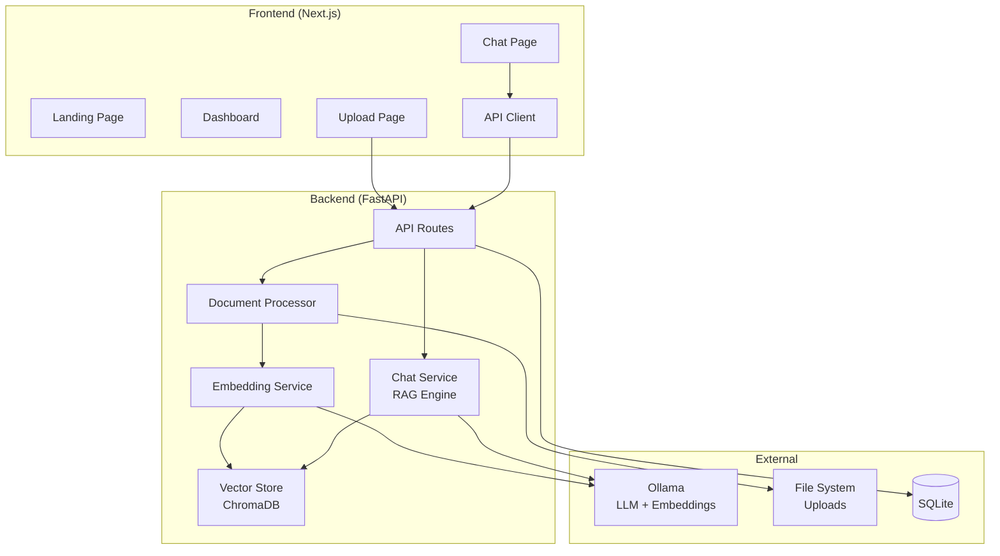

# Architecture Diagram



## Request Flows

### Upload Flow
```
User Uploads File → Next.js → POST /api/upload → FastAPI → 
Validate File → Save to Disk → Extract Text → 
Chunk Text → Generate Embeddings → Store in ChromaDB
```

### Chat Flow
```
User Asks Question → Next.js → POST /api/chat → FastAPI →
Semantic Search in ChromaDB → Retrieve Top-K Chunks →
Format Context → Send to Ollama LLM → 
Stream Response Back → Parse References →
Render Markdown in Chat UI
```

## Data Flow

```
Documents ─→ Text Extraction ─→ Chunking ─→ Embeddings ─→ ChromaDB
                                                              ↑
Question ─────────────────────────────────────────────────────┘
                                                              ↓
                                                     Retrieve Context
                                                              ↓
                                              LLM (Ollama) + System Prompt
                                                              ↓
                                                    Answer + References
```
